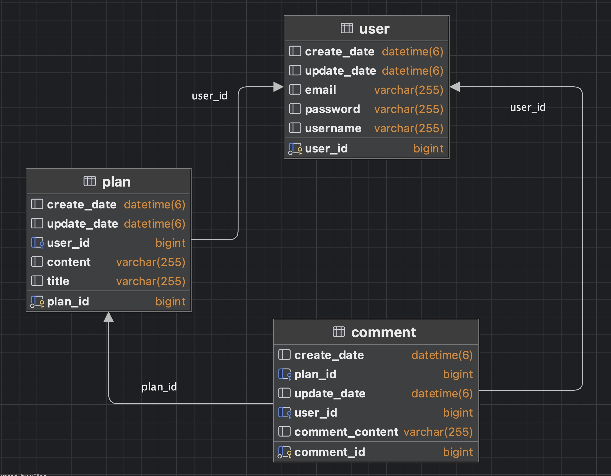

# 일정 관리 앱 2
## 기능목록
- 모든 테이블은 고유 식별자(ID)를 가진다
- `3 Layer Architecture` 에 따라 각 Layer의 목적에 맞게 개발
- CRUD 필수 기능은 모두 데이터베이스 연결 및  `JPA`를 사용해서 개발
- JPA 연관관계는 `양방향`으로 구현
 
[//]: # (- 인증/인가 절차는 `JWT`를 활용하여 개발.)

### 일정
- 일정 저장, 조회(단건,페이지), 수정, 삭제

### 댓글 

- 일정 저장, 조회, 수정, 삭제

### 유저
- 유저 생성, 조회, 수정, 삭제

## API 명세서
### 일정

### 댓글

### 유저

## ERD

